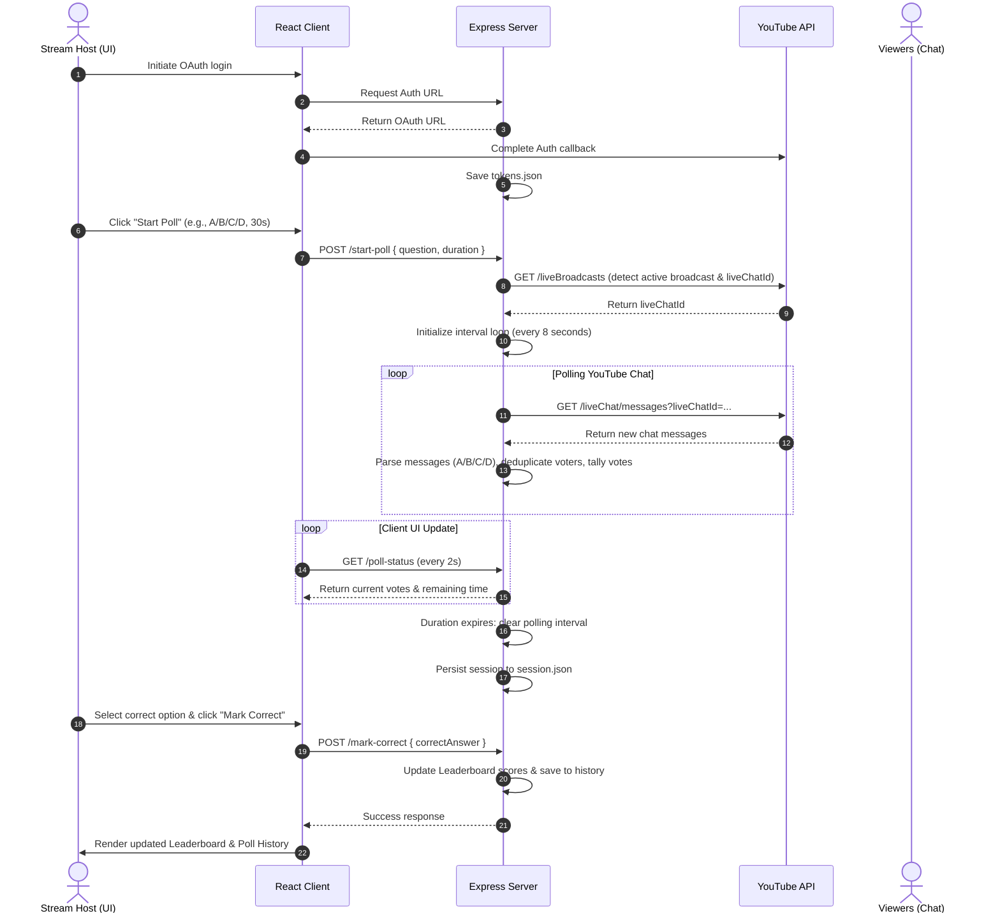

# LiveQuiz AI 📊

An AI-powered YouTube Live quiz platform for streamers, educators, and creators. Hosts generate a quiz from a topic, run each question as an A–D YouTube Live Chat poll, reveal explanations, and review session feedback.

The project is structured as a monorepo consisting of:
*   **`client/`**: A React + Vite + TypeScript frontend application styled with modern aesthetics. It can be run in the browser or wrapped as a native desktop application using Electron.
*   **`server/`**: A Node.js + Express backend that coordinates authentication, polls YouTube chat messages, processes votes, keeps track of leaderboard scores, and handles persistent storage.

---

## 🏗️ Architecture & Vote Flow

The diagram below illustrates how the frontend client, the backend server, and the YouTube APIs communicate to orchestrate a live poll:



---

## ✨ Features

*   **OAuth 2.0 Authentication**: Official YouTube integration using Google OAuth to safely retrieve the host's credentials and channels.
*   **Active Stream Detection**: Automatically finds the active live broadcast for the authenticated user and retrieves its corresponding `liveChatId`.
*   **Chat Message Polling**: Polls YouTube Live Chat messages every 8 seconds, dynamically matches chat comments to active poll options (e.g., "A", "B", "C", "D"), and filters out duplicates so each participant only votes once.
*   **Viewer Statistics**: Uses YouTube APIs to check and display the number of concurrent stream viewers in real-time.
*   **Leaderboard**: Tallies cumulative points for participants based on correct answers marked by the host and sorts players in a premium interactive component.
*   **Electron Desktop Wrapper**: Includes configuration scripts to run the web interface inside a native desktop app context.
*   **Session Persistence**: Automatically saves session state, leaderboard, and poll history to `session.json`, and login credentials to `tokens.json`.
*   **AI Quiz Generation**: Generates a validated queue of multiple-choice questions with answers and explanations through the OpenAI Responses API.
*   **AI Session Feedback**: Summarizes deterministic session statistics into concise host recommendations.
*   **OBS Overlay**: Provides a transparent `/overlay` display with the active question, countdown, and live vote bars.

---

## 🛠️ Tech Stack

### Frontend (`client/`)
*   **Core**: React 19, TypeScript 6, Vite 8
*   **Styling**: CSS with modern aesthetics (dark mode, glassmorphism, responsive grid layouts)
*   **Desktop App Integration**: Electron 42, `electron-builder`
*   **State & Routing**: React Hooks, React Router DOM 7, custom `usePoll` and `useAuth` state-machines

### Backend (`server/`)
*   **Runtime & Framework**: Node.js, Express 5
*   **APIs & Utilities**: Official `openai` and `googleapis` libraries, Axios, CORS, Dotenv

---

## 🚀 Setup & Installation

### Prerequisites
1.  **Google Cloud Project**: Set up a project in the [Google Cloud Console](https://console.cloud.google.com/).
2.  **Enable YouTube Data API v3**: Go to the API Library in the console and enable the "YouTube Data API v3".
3.  **OAuth Credentials**:
    *   Create an **OAuth 2.0 Client ID** (Application type: *Web application*).
    *   Set the **Authorized Redirect URI** to `http://localhost:3001/auth/callback` (or your configured backend callback).
    *   Copy the Client ID and Client Secret.

---

### Backend Setup (`server/`)

1.  Navigate to the server directory:
    ```bash
    cd server
    ```
2.  Install dependencies:
    ```bash
    npm install
    ```
3.  Create a `.env` file in the `server` directory and add the following:
    ```env
    PORT=3001
    YOUTUBE_CLIENT_ID=your_google_oauth_client_id
    YOUTUBE_CLIENT_SECRET=your_google_oauth_client_secret
    REDIRECT_URI=http://localhost:3001/auth/callback
    OPENAI_API_KEY=your_openai_api_key
    # Optional; defaults to gpt-5.6
    OPENAI_MODEL=gpt-5.6
    ```
4.  Start the server:
    ```bash
    npm start
    ```
    The server will run on `http://localhost:3001` (or the port defined in `.env`).

---

### Frontend Setup (`client/`)

1.  Navigate to the client directory:
    ```bash
    cd client
    ```
2.  Install dependencies:
    ```bash
    npm install
    ```
3.  Create `client/.env` from `client/.env.example`. The local API is the default; set `VITE_API_BASE_URL` only when using a deployed backend.
4.  Start the application:
    *   **To run in Web browser**:
        ```bash
        npm run dev
        ```
        Opens on `http://localhost:5173`.
    *   **To run in Electron Desktop**:
        ```bash
        npm run electron
        ```

---

## 📡 API Endpoints

The backend exposes the following REST APIs:

### 🔑 Authentication Routes
*   `GET /auth/url`: Generates and returns the Google OAuth URL for YouTube API access.
*   `GET /auth/callback`: Handles the redirect from Google OAuth, exchanges the auth code for access/refresh tokens, and persists them.
*   `GET /auth/status`: Checks if the server is authenticated and returns the profile of the current YouTube Channel.
*   `POST /auth/logout`: Clears authorization tokens and logs out the channel.

### 📊 Poll Control Routes
*   `POST /start-poll`: Starts polling YouTube chat messages.
    *   **Body Parameters**:
        ```json
        {
          "pollType": "Single Choice", 
          "duration": 30000, 
          "question": "JavaScript Quiz"
        }
        ```
*   `GET /poll-status`: Returns the active poll status, countdown, question metadata, and live vote totals/percentages for the host UI and OBS overlay.
*   `GET /poll-result`: Calculates and returns the vote counts and percentages for each option (A, B, C, D) after the poll ends.
*   `POST /mark-correct`: Designates the correct option, updates the session leaderboard, and saves results to poll history.`
    *   **Body Parameters**:
        ```json
        {
          "correctAnswer": "B"
        }
        ```
*   `POST /stop-poll`: Force-stops the active poll immediately.
*   `POST /reset-poll`: Resets the active poll status and variables.

### 📈 Session & History Routes
*   `GET /session-summary`: Returns the session leaderboard (sorted by number of correct answers) and full poll history.
*   `POST /reset-session`: Wipes all session statistics, clears leaderboard history, resets the current poll, and deletes `session.json`.

### ✨ AI Quiz Routes
*   `POST /ai/generate-quiz`: Generates and persists a quiz queue.
    ```json
    { "topic": "React hooks", "difficulty": "Medium", "questionCount": 5 }
    ```
*   `POST /ai/next-question`: Starts the next generated question as a YouTube A–D poll.
    ```json
    { "duration": 30000 }
    ```
*   `POST /ai/session-summary`: Produces AI coaching feedback from server-calculated session metrics.

---

## 🎥 OBS Overlay

While the client is running, add a Browser Source in OBS that points to `http://localhost:5173/overlay`.

* Use a 16:9 source such as `1920 × 1080`.
* The route intentionally renders nothing when no poll is active, keeping the stream unobstructed.
* Keep the API server running; the overlay refreshes live poll data every two seconds.

---

## ✅ Live Stream Verification

1. Start the server and client, then sign in with the YouTube channel that owns the livestream.
2. Start a YouTube broadcast with live chat enabled and confirm the host dashboard reports no authentication error.
3. Generate a short AI quiz, start its first question, and send `A`, `B`, `C`, or `D` from a separate viewer account.
4. Confirm both the host dashboard and `/overlay` update the countdown and vote totals.
5. Stop or let the poll expire, mark the answer, and confirm the explanation and leaderboard update.
6. Start the next question, then open Session History and request AI feedback after at least one scored question.

---

## 📂 Project Structure

```
live-polling/
├── client/
│   ├── electron/
│   │   ├── main.js             # Electron main process configuration
│   │   └── preload.js          # Electron bridge script
│   ├── src/
│   │   ├── api/
│   │   │   ├── httpClient.ts   # Custom fetch wrapper
│   │   │   ├── authService.ts  # API wrappers for auth endpoints
│   │   │   └── pollService.ts  # API wrappers for poll endpoints
│   │   ├── components/
│   │   │   ├── ActivePoll.tsx  # Countdown & active state display
│   │   │   ├── CreatePoll.tsx  # Settings panel for new poll parameters
│   │   │   ├── Leaderboard.tsx # High scores rendering
│   │   │   ├── PollResults.tsx # Dynamic bar chart and correct answer marker
│   │   │   └── SessionOverview.tsx # History summary panel
│   │   ├── hooks/
│   │   │   ├── useAuth.ts      # Authentication state machine
│   │   │   └── usePoll.ts      # Polling state machine
│   │   ├── App.tsx             # Main view router
│   │   └── main.tsx            # React application entry point
│   ├── package.json
│   └── vite.config.ts
│
├── server/
│   ├── controllers/
│   │   └── pollController.js   # Request handler routes logic
│   ├── routes/
│   │   └── pollRoutes.js       # App router map
│   ├── services/
│   │   ├── authService.js      # OAuth client helpers
│   │   └── youtubeService.js   # Chat reader and stream watcher APIs
│   ├── store/
│   │   └── pollStore.js        # In-memory storage and session file output
│   ├── index.js                # App entry point & startup listener
│   ├── package.json
│   ├── session.json            # Cumulative leaderboard and poll history (Auto-generated)
│   └── tokens.json             # YouTube OAuth access & refresh credentials (Auto-generated)
└── README.md                   # Project documentation
```
